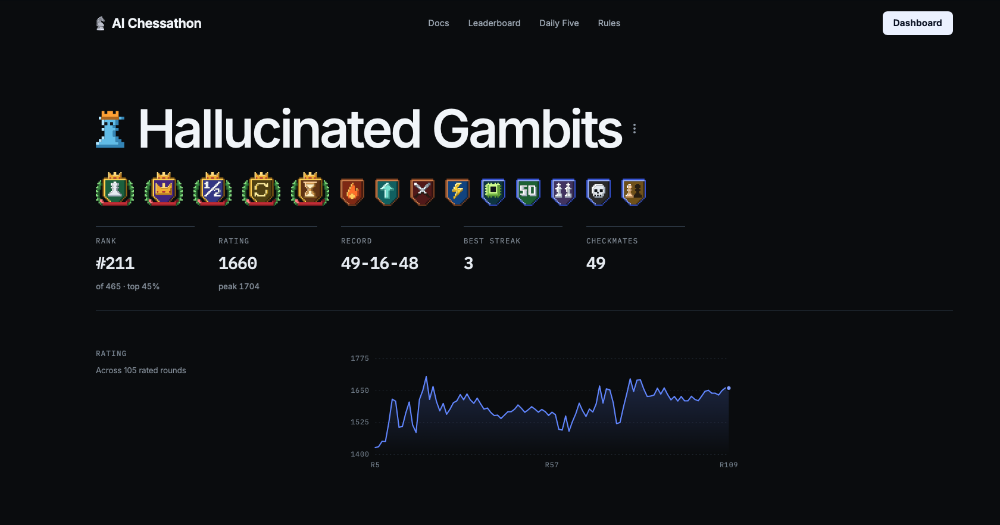
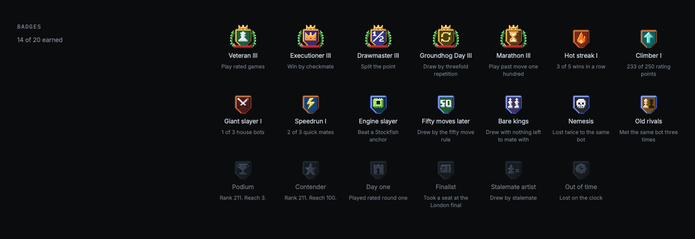

# Hallucinated Gambits

A Python chess engine developed with AI coding assistance for AI Chessathon 2026. The final competition entry uses original search and classical evaluation, compiled with Numba, plus a human-game opening book. It does not run Stockfish or a pretrained neural chess engine.

**Peak competition rating: 1704 · displayed rank: 211/465 (top 45%) · 11 submission versions.**

The screenshots supplied on 14 September show a rating of 1660, peak 1704, displayed rank 211/465, 49 wins, 16 draws, 48 losses and 49 checkmates. These are the platform's displayed totals, not a verified final Swiss placement. Competition ratings are not FIDE or human online ratings. The chart and record cover different displayed totals; no per-version record is inferred.



The badge screenshot is included as platform context only. Badge labels and descriptions are copied from the visible dashboard; they should not be treated as independent awards or claims beyond the platform's own achievement system.



## What this demonstrates

- Engineering under a clock: efficient move generation, reversible board state, iterative deepening, alpha-beta/PVS, transposition tables and selective search.
- Measurement: differential legality checks, fixed-depth parity tests, timed benchmarks and colour-swapped matches against frozen versions.
- Experimental judgment: neural and positional candidates were rejected when faster inference, prediction accuracy or nicer-looking moves failed to translate into reliable improvements.

The strongest local v11 comparison scored **31W–14D–3L against v10 in 48 games at 120 seconds + 0.5 seconds/move**. Its opening-pair bootstrap interval was 71.875–86.458% score. This is a local, opponent-specific result, not a predicted Elo gain or a tournament win rate.

Read [the version history and lessons](CASE_STUDY.md) and [provenance](PROVENANCE.md).

## Run a move

Use Python 3.12 and a compatible environment for the pinned competition-era dependencies:

```sh
python3.12 -m venv .venv
.venv/bin/python -m pip install -r requirements.txt
.venv/bin/python smoke.py
```

Import compiles the search and loads the book before move timing starts. The API is `get_move(fen: str, time_left_ms: int) -> str`, returning a legal UCI move for a nonterminal position. The process is intended to survive for one game; start a fresh process for another game. Diagnostic output is expected. This is the competition API, not a complete UCI GUI adapter.

## Code map

| File | Purpose |
|---|---|
| `agent.py` | Entry point, observed game history, book selection and legal fallback |
| `lmr_core.py` | Board representation, legal moves, make/unmake and hashes |
| `lmr_search.py` | Evaluation, search, move ordering and time allocation |
| `config.py` | Frozen v11 feature switches |
| `opening_book.py` | Conservative book lookup and exit conditions |
| `human_book.json` | 56,333 prepared positions from filtered human games |
| `smoke.py` | One-move legality demonstration |

The six engine/data files are byte-identical to the retained final v11 package source. This curated edition omits private research logs, unrelated experiments and local-machine paths. It is a demonstration export, not the complete experiment archive. Full historic benchmarks are described but are not all reproducible from this smaller export alone.

Built on the AI Chessathon starter; its MIT notice is retained. See [provenance and attribution](PROVENANCE.md).
